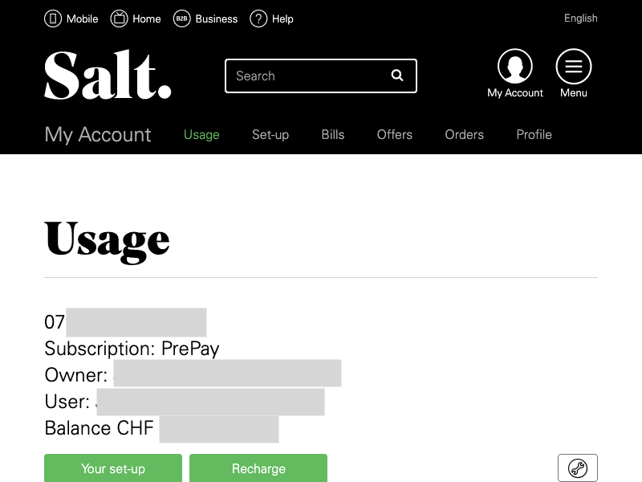

# Salt Headless - API

[](https://www.npmjs.com/package/salt-headless)
[](https://github.com/Nexysweb/salt-headless/actions/workflows/publish.yml)

Retrieve account information via headless browser

## Usage

`USERNAME=myusername PASSWORD=mypassword node dist/exec.js`

## install and run

```
yarn
yarn build
```

## Under the hood

Puppeteer mimicks the behavior of a webbrowser. See differetn steps below



